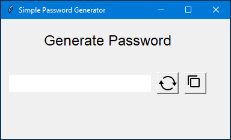
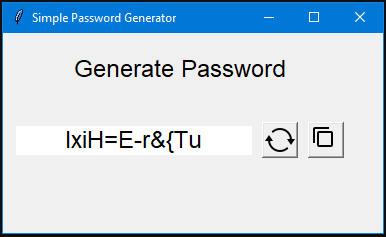
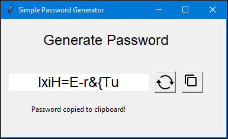

# password-generator
A simple password generator with GUI. 
Generate a twelve-character password containing alphanumeric and punctuation symbols.

# Usage
* Start a program by running:
```
git clone https://github.com/shuraosipov/password-generator.git
cd password-generator
python main.py
```
* A new window will be opened:
<p align="left"></p>

* Click on generate password icon to create a new password:
<p align="left"></p>

* Click on copy icon to copy password to the clipboard:
<p align="left"></p>

* Enjoy!


